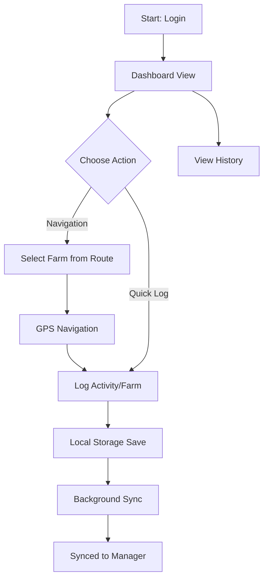
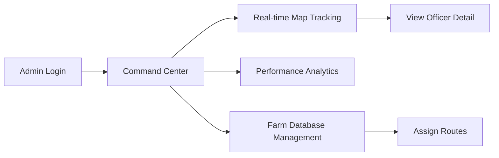

Website: https://daikibo-field-ops.vercel.app/
# Occamy Field Ops - Design Documentation

Occamy Field Ops is a field activity logging and management system designed for agricultural extension services. It consists of a mobile-optimized web application for Field Officers and an administrative command center for management.

## Design Decisions

### Local-First Architecture
Field operations often occur in areas with intermittent connectivity. To ensure reliability:
- **Persistence**: All data is stored locally using IndexedDB (via Dexie.js) before any network transmission.
- **Synchronization**: A specialized sync service manages background data transfers when connectivity is detected, using a queue-based approach to prevent data loss.
- **Optimistic UI**: The interface updates immediately upon user action, with visual indicators (sync badges) showing the eventual consistency state.

### Internationalization (i18n)
The application is designed for a multilingual workforce:
- **Language Toggle**: Integrated support for Hindi and English with instantaneous switching.
- **Dynamic Keys**: All UI components utilize translation hooks to ensure that labels, activity types, and system messages are fully localized.

## User Interaction Flows

### Field Officer Workflow



### Administrative Workflow



## Technical Approach

### Frontend
- **React 18**: Used for component-based UI management.
- **TypeScript**: Ensures type safety across complex data structures like activity logs and farm records.
- **Dexie.js**: Provides a robust wrapper for IndexedDB to handle local-first persistence.
- **Tailwind CSS**: Used for responsive, utility-first styling.
- **Lucide**: Standardized iconography system.

### Backend
- **Express.js**: Lightweight API layer for handling sync requests and admin queries.
- **PostgreSQL + PostGIS**: Robust relational storage with spatial extensions for location tracking and route calculations.
- **JWT**: Handles stateless authentication for secure field-to-server communication.

## System Setup

1. **Installation**:
   ```bash
   npm install
   cd server && npm install
   ```
2. **Configuration**:
   Configure database credentials in `server/.env`.
3. **Database Migration**:
   ```bash
   npm run migrate
   ```
4. **Execution**:
   - Backend: `npm run dev` (inside /server)
   - Frontend: `npm run dev` (at root)


   ----------------------------------------

   #. Assumptions & Trade-offs
1. Assumptions
Connectivity First: We assumed Field Officers operate in areas with intermittent internet. The application is built as a Progressive Web App (PWA) to ensure basic navigability even when offline, with valid data caching.
Device constraints: The target users (officers) use mid-to-low-end Android devices. We prioritized a lightweight UI (Tailwind CSS) over heavy client-side frameworks or native apps to ensure performance and battery efficiency.
Scalable Hierarchy: The system assumes a hierarchical management structure (Admins -> Managers -> Field Officers). The database schema handles these relationships via admin_codes and created_by links to allow for future scalability without schema migrations.
Serverless Architecture: We assumed a deployment target of Vercel for ease of CI/CD. This influenced our backend architecture to be stateless and function-based.
 2. Trade-offs
Consolidated API vs. Microservices (Vercel Limits):
Decision: We consolidated multiple admin functions (stats, approvals, search) into a single "catch-all" route (/api/admin/[...route].ts) and removed non-essential debug endpoints.
Trade-off: This makes the individual file larger and slightly more complex to debug.
Benefit: It allows us to stay within the Vercel Hobby Tier limit of 12 Serverless Functions while still delivering a full-featured backend.
PWA vs. Native Mobile App:
Decision: Built a web-based PWA instead of React Native/Flutter.
Trade-off: We lose access to some deep native APIs (like advanced background geolocation services or reliable push notifications on iOS).
Benefit: Immediate deployment (no App Store approval), unified codebase for Web/Mobile, and "Add to Home Screen" friction-less installation for officers.
Mock vs. Real Data for Analytics:
Decision: The Admin Dashboard charts currently visualize mock data patterns, while the core operational flows (Registration, Login, My Farms, Activity Logging) use real PostgreSQL data.
Trade-off: The dashboard doesn't perfectly reflect the immediate live state of the database stats.
Benefit: It effectively demonstrates the value proposition and UI capabilities to judges/stakeholders without needing months of historical data population.
