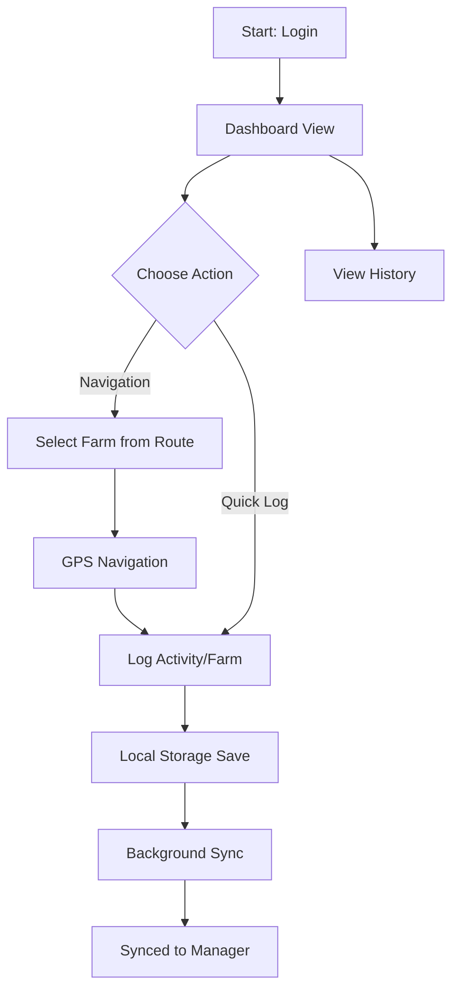
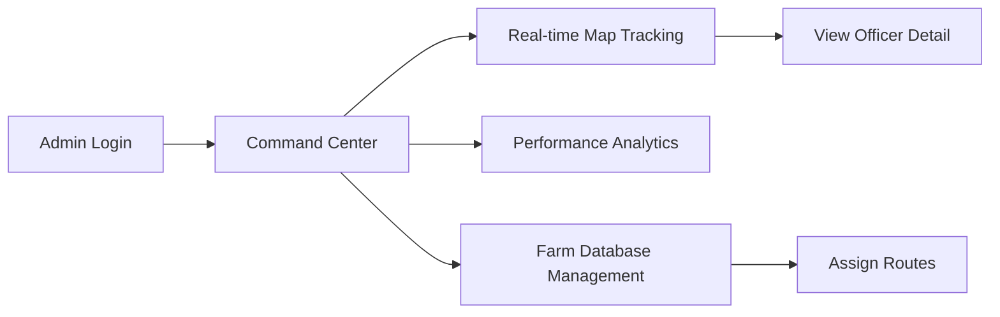

Website: https://daikibo-field-ops.vercel.app/
# Occamy Field Ops - Design Documentation

Occamy Field Ops is a field activity logging and management system designed for agricultural extension services. It consists of a mobile-optimized web application for Field Officers and an administrative command center for management.

## Design Decisions

### Local-First Architecture
Field operations often occur in areas with intermittent connectivity. To ensure reliability:
- **Persistence**: All data is stored locally using IndexedDB (via Dexie.js) before any network transmission.
- **Synchronization**: A specialized sync service manages background data transfers when connectivity is detected, using a queue-based approach to prevent data loss.
- **Optimistic UI**: The interface updates immediately upon user action, with visual indicators (sync badges) showing the eventual consistency state.

### Internationalization (i18n)
The application is designed for a multilingual workforce:
- **Language Toggle**: Integrated support for Hindi and English with instantaneous switching.
- **Dynamic Keys**: All UI components utilize translation hooks to ensure that labels, activity types, and system messages are fully localized.

## User Interaction Flows

### Field Officer Workflow



### Administrative Workflow



## Technical Approach

### Frontend
- **React 18**: Used for component-based UI management.
- **TypeScript**: Ensures type safety across complex data structures like activity logs and farm records.
- **Dexie.js**: Provides a robust wrapper for IndexedDB to handle local-first persistence.
- **Tailwind CSS**: Used for responsive, utility-first styling.
- **Lucide**: Standardized iconography system.

### Backend
- **Express.js**: Lightweight API layer for handling sync requests and admin queries.
- **PostgreSQL + PostGIS**: Robust relational storage with spatial extensions for location tracking and route calculations.
- **JWT**: Handles stateless authentication for secure field-to-server communication.

## System Setup

1. **Installation**:
   ```bash
   npm install
   cd server && npm install
   ```
2. **Configuration**:
   Configure database credentials in `server/.env`.
3. **Database Migration**:
   ```bash
   npm run migrate
   ```
4. **Execution**:
   - Backend: `npm run dev` (inside /server)
   - Frontend: `npm run dev` (at root)
